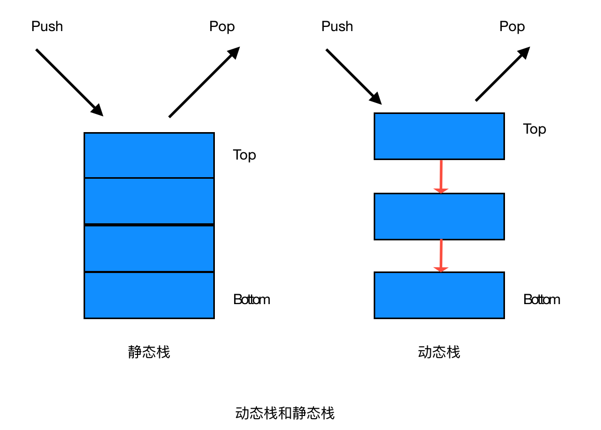

# 数据结构和算法

## 目录

1. 简单的数据结构
	* 栈、队列、链表、数组、哈希表
	* 栈和队列的相同和不同之处
	* 栈通常采用的两种存储结构 
2. 树
	* 二叉树、字典树、平衡树、排序树
	* B 树、B+ 树、R 树、多路树、红黑树

3. 堆
	* 大根堆、小根堆

4. 图
	* 有向图、无向图、拓扑

5. 排序算法
	* 稳定的排序
		* 冒泡排序
		* 插入排序
		* 鸡尾酒排序
		* 桶排序
		* 计数排序
		* 归并排序
		* 原地归并排序
		* 二叉排序树排序
		* 鸽巢排序
		* 基数排序
		* 侏儒排序
		* 图书馆排序
		* 块排序
	* 不稳定的排序
		* 选择排序
		* 希尔排序
		* Clover 排序算法
		* 梳排序
		* 堆排序
		* 平滑排序
		* 快速排序
		* 内省排序
		* 耐心排序  

6.  两个栈实现队列，和两个队列实现栈
7. 深度优先和广度优先搜索
8. 全排列、贪心算法、KMP 算法、hash 算法
9.  海量数据处理
	* 分治，hash 映射，堆排序，双层桶划分，Bloom Filter，bitmap，数据库索引，mapreduce 

## 数据结构
### 栈
栈是一种“先进后出”的一种数据结构，有压栈出栈两种操作方式
#### 栈的分类
栈主要分为两类：

* 静态栈
* 动态栈

**【静态栈】**

静态栈的核心是数组，类似于一个连续内存的数组，我们只能操作其栈顶元素。

**【动态栈】**

静态栈的核心是数组，类似于一个连续内存的数组，我们只能操作其栈顶节点。

#### 栈的算法
首先要明白以下思路：

* 栈操作的是一个一个节点
* 栈本身也是一种存储的数据结构
* 栈有初始化、压栈、出栈、判空、遍历、清空等主要方法

#### 栈的应用
*  数制转换
*  括号匹配的检验
#### 栈通常采用的两种存储结构
#### 参考地址
* [https://www.cnblogs.com/xiaoyouPrince/p/8082640.html](https://www.cnblogs.com/xiaoyouPrince/p/8082640.html)

### 队列

#### 栈和队列的相同与不同
### 链表
### 数组
### 哈希表

