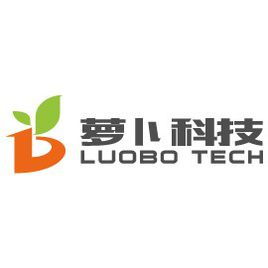
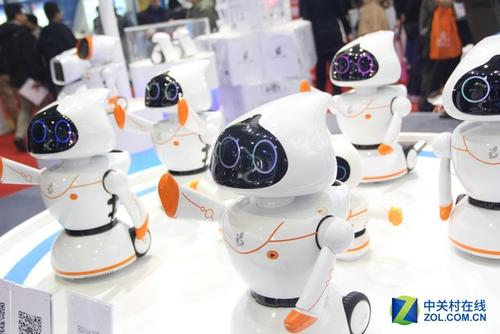

> ### 个人信息

**姓 名：李冲**	

工作年限：8 年		                 

岗位：Android高级工程师

学 历：本科

邮  箱：*lichongmac@163.com*        

专 业：计算机科学与技术

博客地址：*[http://blog.51cto.com/4789781](http://blog.51cto.com/4789781)*  

# 工作经历
## 广联达科技股份有限公司（股票代码：002410）
2019/03--至今

**项目：人帽一体机**

**项目：新工地宝**

**项目：速登宝**

## 亮风台信息科技有限公司

2017/05--2018/12 

**项目：HiARSDK定制化开发**

**简介：** 
	
	主要服务于：
				汽车之家
				玉泉旅游景区
				上汽AR说明书
				民生银行研究院
				河北师大AR实验室等

**关键技术：**

	图像识别、图像跟踪、slam位姿跟踪等底层算法集成；
				
	Camera相机方案优化等；

主要职责：

	按客户AR业务场景需求选择合适的图像方案，设计开发交付符合客户要求（包体大小、性能等）的HiARSDK集成包；
	提供Android技术支持2D图像算法组、Slam位姿识别算法组、CNN卷积网络或神经网络算法组；
	设计开发Android工程化开发测试流程；
	

**项目：AR教学之化学分子方程式展示**

**简介：**
	
	应某大学在科技教育的背景下，提倡使用AR/VR技术进行物理、化学教学。提高教学质量，同时也开拓同学们队新技术新概念的认知
	主要展示：
		1、元素周期表的常见元素的物理属性
		2、常见较为简单的化学方程式反应过程模拟
		3、使用AR中包括的图像识别、图像跟踪、模型渲染等技术
		
**职责：**

	1、参考实际的元素、分子式、实物等物理属性设计合理的渲染模型
	2、参考实际的化学反应方程式设计合理的化学反应过程。例如：H + O 在燃烧的情况下生成水
	3、针对识别图的规范提供提高识别率的建议
	4、设计一系列化学反应方程式的反应逻辑过程并实现开发
	5、结合同事、客户以及专业老师的使用体验情况；快速迭代版本并发布，提高开发质量，交互体验质量等
	6、快速迭代发布android、IOS、PC、MAC等平台安装测试包

**作品展示：**

## 北京萝卜科技有限公司

2015/06--2017/03  (现已搬到深圳办公)

**项目：小萝卜伙伴机器人**

**简介：**
	
	一个童年 一个机器人陪伴，是送给孩子最好的礼物，小萝卜大功能：情感成长、陪玩耍、记忆成长、陪聊天、陪学习、智慧成长等。

	陪玩耍：小萝卜伙伴机器人的动作有8个自由度、灵活智能。可以像赛道一样奔跑，可以翩翩起舞，可以跳小苹果。
	
	陪学习：实现多维度的早教方式，提供进阶式学习内容，满足不同年龄阶段小孩的启蒙教育。
	
	陪聊天：具备准确的语音识别，强大的语义分析，可以流畅对话。内置英语词典。
	
	智慧成长：通过云平台，持续更新服务内容
	
	记忆成长：记录孩子的语言资料，图像资料、视频资料，是童年的记录者
	
	情感成长：了解孩子的行为习惯，逐渐产生感性反馈习惯

**项目整体结构：**外设硬件+android系统+手机App+后台云服务

**职责：**主要是android端（即机器人端）功能
	
	1、用户功能：唱歌、跳舞、讲故事、对话等语音交互，涉及语音识别、语义理解、定制语音合成音播放
	
	2、外设部分：协商通信协议完成眼睛闪烁、手臂、轮子等硬件的运动控制
	
	3、手机APP部分：App通过蓝牙连接机器人，app发出指令完成跳舞、讲故事、编程等功能。协商制定通信协议
	
	4、协商制定机器人端每个阶段的开发细则任务，担任机器人端的开发组leader角色
	
	5、对接第三方技术集成（android系统定制；语音技术提供；语义理解；语音合成；行为统计）
	
	6、重构抽取业务层快速交付第三方机器人的定制开发（如：浦发银行小浦、海淀安全馆安全大使））
	
	7、技术面试应聘的Android开发工程师，组建Android开发团队
	
	8、对外提供技术支持服务，对公司的工厂提供android技术支持促进机器人量产
小萝卜展出留影

	

## 车讯互联

2012/05--2015/06 （清华科技园办公）

**项目：买车通**

**简介：**
	
	《买车通》助你轻松买到好车；买车通是车讯专为购车用户精心打造的一款看车、比车、询价等功能齐全的移动App
	
		全新的用户体验：界面交互全面升级，买车更迅捷
	
		流畅的UI设计：各种车型图片车内装饰，还有性感动人的车模MM相伴，如此香车美人
	
		价格优惠 一看便知：各大城市4s店的最新车型，车款、价格优惠详情等一目了然
	
		购车计算：内置各大城市的购车计算方式，裸车价、购置税、车船使用税等计算方式和花费项目。
	
		拆车坊：《拆车坊》节目视频播放。
		
**职责：**

	1、刚开始独立开发，后来随着业务扩展；进行技术面试把关组建android技术团队
	
	2、按产品需求制定app开发计划时间表；拆分需求制定app版本迭代计划
	
	3、按市场营销活动计划，制定相应的营销功能
	
	4、统计分析购车客户的使用习惯，迭代交互设计方案
	
	5、统计分析图片浏览习惯，提供更多客户浏览量高的相关香车图片
	
	6、统计分析使用app的分布情况，定期给市场以及其他部门提供数据报告，提高了4s广告的精准投放
	
	7、解析竞争app的技术、使用习惯、UI迭代趋势、内容质量、用户粘性等，提供详尽的竟品报告
	
	8、常规的性能优化、UI适配、分辨率适配、机型适配、省电策略以及android技术解决方案等

> ### 专业技能
	
	java：熟悉java的编程原理，理解OpenGL 熟练使用常见设计模式、熟练使用Android studio
	
	C#	:	熟悉C# 编译原理。会使用Unity3D构建业务模型
	
	C/C++:了解c、c++编译运行过程。熟悉JNI接口编辑
	
	串口通信技术，UI布局适配，性能优化，多线程，常用的开源框架
	
	工具链：Android studio、Unity3D、Jenkins、Junit、Espresso、Gradle、pepline、MyQR、Git等
	
	

