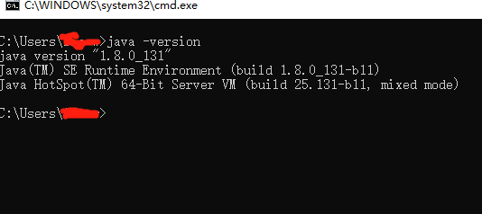

## Jenkins+AndroidSDK+Node.js+http-server+qr.jar+163邮箱服务大纲
> 目录


[JDK](#JDK)
[Android SDK](#Android SDK)
[Git](#Git)
[Jenkins](#Jenkins)
[Gradle](#Gradle)
[Node](#Node)
[配置Job](#配置Job)
[二维码生成](#二维码生成)
[集成RSS](#集成RSS)
[apk版本设置为名称](#Apk版本设置为名称)
[](#)

## Apk版本设置为名称

> 参考
[https://juejin.im/entry/5adaa9ecf265da0ba062b9a1](https://juejin.im/entry/5adaa9ecf265da0ba062b9a1)
[]()

## JDK

> 安装

下载地址：[http://www.oracle.com/technetwork/java/javase/downloads/index.html](http://www.oracle.com/technetwork/java/javase/downloads/index.html)

根据电脑环境安装合适的版本

> 配置

    在"用户变量"中设置3项属性，JAVA_HOME,PATH,CLASSPATH(不区分大小写),若已存在则点击"编辑"，注意用分号与前面的隔开，不存在则点击"新建"。

    变量设置参数如下：

    变量名： JAVA_HOME
    变量值： C:\Program Files\Java\jdk1.8.0_111
    变量名： Path
    变量值： %JAVA_HOME%\bin;%JAVA_HOME%\jre\bin;
    变量名： CLASSPATH
    变量值： .;%JAVA_HOME%\lib\dt.jar;%JAVA_HOME%\lib\tools.jar;       
    注意：这前面有一个点‘.’


> 测试

    command(window键)+R,然后输入cmd,确定后输入命令: java、javac 几个命令


## Android SDK

> sdk安装
下载地址：[Android Studio](https://developer.android.com/studio)

下载Android studio即可在安装流程里下载AndroidSDK


> 环境配置（可选）

ANDROID_HOME=“安装目录”

> 测试
使用adb进行命令测试如下图


> 参考

[Android Studio](https://developer.android.com/studio)

## Git
> 安装
安装教程
[https://www.jianshu.com/p/414ccd423efc](https://www.jianshu.com/p/414ccd423efc)

> 测试
在终端输入 “git --version”如下图：


> ssh
    ssh-keygen -t rsa -C "youremail@example.com"

验证

    例子：ssh -T git@code.aliyun.com
    返回 Welcome to GIT, 用户名! 成功

> 参考地址
[官网安装教程](https://git-scm.com/book/zh/v2/%E8%B5%B7%E6%AD%A5-%E5%AE%89%E8%A3%85-Git)

## Jenkins

Jenkins特性：

1、易于安装-本文提供四种配置方式。

2、易于配置-所有配置都是通过其提供的web界面实现。

3、**集成RSS**/E-mail通过RSS发布构建结果或当构建完成时通过e-mail通知。

4、生成JUnit/TestNG测试报告。

5、分布式构建支持Jenkins能够让多台计算机一起构建/测试。

6、文件识别:Jenkins能够跟踪哪次构建生成哪些jar，哪次构建使用哪个版本的jar等。

7、插件支持:支持扩展插件，你可以开发适合自己团队使用的工具。

8、Jenkins一切配置都可以在web界面上完成。有些配置如MAVEN_HOME和Email，只需要配置一次，所有的项目就都能用。当然也可以通过修改XML进行配置。

9、支持Maven的模块(Module)，Jenkins对Maven做了优化，因此它能自动识别Module，每个Module可以配置成一个job。相当灵活。

10、测试报告聚合，所有模块的测试报告都被聚合在一起，结果一目了然，使用其他CI，这几乎是件不可能完成的任务。

11、构件指纹(artifact fingerprint)，每次build的结果构件都被很好的自动管理，无需任何配置就可以方便的浏览下载。

> 平台安装

[jenkins官网](https://link.jianshu.com/?t=https%3A%2F%2Fjenkins.io%2F)

* mac

`brew install jenkins`

* window

官网下载Jenkin.war包

[安装方式参考](https://www.jianshu.com/p/400b4516b98e)

> 各种插件配置见[Jenkins插件列表](#Jenkins插件列表)

> 测试运行

* mac

    `jenkins`

* window

  `java -jar jenkins.war` 

## Jenkins插件列表

* Build Timeout
* description setter plugin
* Email Extension Plugin
* GitHub Branch Source Plugin
* Gradle Plugin
* SSH Slaves plugin
* Timestamper
* Publish over ssh
* 

> 参考地址
[https://www.jianshu.com/p/400b4516b98e](https://www.jianshu.com/p/400b4516b98e)
[https://blog.csdn.net/RonnyJiang/article/details/51208009](https://blog.csdn.net/RonnyJiang/article/details/51208009)
[https://segmentfault.com/a/1190000015391418](https://segmentfault.com/a/1190000015391418)

## Gradle(可选)
[Gradle官网](https://gradle.org/)
> 各平台安装
* mac

`brew install gradle`

* liunx、unbuntu和centos

`sdk install gradle 4.6`

* 
> 环境变量配置

`$ export PATH=$PATH:/opt/gradle/gradle-4.6/bin`

> 测试

`gradle -v`

出现如下：

```
------------------------------------------------------------
Gradle 4.6
------------------------------------------------------------
Build time:   2018-02-28 13:36:36 UTC
Revision:     8fa6ce7945b640e6168488e4417f9bb96e4ab46c

Groovy:       2.4.12
Ant:          Apache Ant(TM) version 1.9.9 compiled on February 2 2017
JVM:          1.8.0_161 (Oracle Corporation 25.161-b12)
OS:           Mac OS X 10.13.3 x86_64
```
* window

`scoop install gradle`

注意：
 * windows可以使用scoop安装
 * windows还可以使用Chocolatey包管理器安装
 
 另：手动安装就不介绍了
 
 
## 二维码生成
> 安装

> 配置
> 测试

> 注：忘记在哪下载的qr.jar包。如有需要发邮件[联系我](#联系我)

## Node
> 安装
> 配置
> 测试
npm install http-server -g

## 配置Job

> 构建触发器

时间设置说明

        * * * * *
        (五颗星，中间用空格隔开）
        第一颗*表示分钟，取值0~59
        第二颗*表示小时，取值0~23
        第三颗*表示一个月的第几天，取值1~31
        第四颗*表示第几月，取值1~12
        第五颗*表示一周中的第几天，取值0~7，其中0和7代表的都是周日

例子如下：


        每15分钟构建一次：H/15 * * * *   或*/5 * * * *
        每天8点构建一次：0 8 * * *
        每天8点~17点，两小时构建一次：0 8-17/2 * * *
        周一到周五，8点~17点，两小时构建一次：0 8-17/2 * * 1-5
        每月1号、15号各构建一次，除12月：H H 1,15 1-11 *
        */5 * * * * （每5分钟检查一次源码变化）
        0 2 * * * （每天2:00 必须build一次源码）

> 构建操作

    echo %JOB_NAME%
    echo %BUILD_NUMBER%
    echo %WORKSPACE%
    copy %WORKSPACE%\app\build\outputs\apk\debug\app-debug.apk C:\Users\{user}\public\apk\%JOB_NAME%-debug-%BUILD_NUMBER%.apk
    cd C:\jenkins
    java -jar qr.jar url=http://10.1.17.54:8000/apk/%JOB_NAME%-debug-%BUILD_NUMBER%.apk image=%JOB_NAME%-debug-%BUILD_NUMBER%.jpg save=C:\Users\{user}\public\qr_img

> Set build desc

    

## 集成RSS

> 邮件通知格式

163邮箱通知设置

[https://blog.csdn.net/yamingwu/article/details/44142635](https://blog.csdn.net/yamingwu/article/details/44142635)

### 模板一

```
Jenkins构建通知:$PROJECT_NAME - Build # $BUILD_NUMBER - $BUILD_STATUS!
```

```
<hr/>

(本邮件是程序自动下发的，请勿回复！)<br/><hr/>

项目名称：$PROJECT_NAME<br/><hr/>

构建编号：$BUILD_NUMBER<br/><hr/>

触发原因：${CAUSE}<br/><hr/>

构建状态：$BUILD_STATUS<br/><hr/>

扫描二维码 
<br/>
下载地址：<a href="http://10.1.90.39:8000/apk/${JOB_NAME}-${BUILD_NUMBER}.apk">http://10.1.90.39:8000/apk/${JOB_NAME}-${BUILD_NUMBER}.apk</a><br>

<hr/>

构建日志地址：<a href="${BUILD_URL}console">${BUILD_URL}console</a><br/><hr/>

构建地址：<a href="$BUILD_URL">$BUILD_URL</a><br/><hr/>

变更集:${JELLY_SCRIPT,template="html"}<br/><hr/>
```

### 模板二

```
Jenkins构建通知:$PROJECT_NAME - Build # $BUILD_NUMBER - $BUILD_STATUS!
```
```
(邮件由Jenkins自动发出，请勿回复~)<br>
项目名称：$PROJECT_NAME<br>
构建编号：$BUILD_NUMBER<br>
构建状态：$BUILD_STATUS<br>
触发原因：${CAUSE}<br>
构建地址：<A HREF="${BUILD_URL}">${BUILD_URL}</A><br>
构建输出日志：<a href="${BUILD_URL}console">${BUILD_URL}console</a><br>
下载地址：<a href="http://10.1.67.54:8000/apk/${JOB_NAME}-debug-${BUILD_NUMBER}.apk">http://10.1.67.54:8000/apk/${JOB_NAME}-debug-${BUILD_NUMBER}.apk</a><br><br>
二维码下载：<br>
最近修改：<br>${CHANGES, showPaths=false, format="%a：\"%m\"<br>", pathFormat="\n\t- %p"}
```


> 建议使用“邮箱大师”|“Foxmail”接收邮件

## 疑难解决
>  553 Mail from must equal authorized user

有些人错误为501 mail from address must be same as authorization user;其实问题是一样的

需要在Jenkins Location中配置系统管理员邮件地址


解决方式如下：
https://blog.csdn.net/yamingwu/article/details/44142635


> SSLHandshakeException
---
There were errors checking the update sites: SSLHandshakeException: sun.security.validator.ValidatorException: PKIX path building failed: sun.security.provider.certpath.SunCertPathBuilderException: unable to find valid certification path to requested target

---

## 附一 参考

[https://blog.csdn.net/u013066244/article/details/78665075](https://blog.csdn.net/u013066244/article/details/78665075)

## 附二 常见问题汇总

Jenkins默认会在Build结束后Kill掉所有的衍生进程，导致后台无法运行应用程序。

在Post Steps ->Execute Shell 中配置的应用程序启动脚本启动后，当Build结束，进程会被Jenkins杀掉。为了在退出Build时继续运行程序，需要进行以下配置，才能避免此类情况发生。

7.1 方式一

a、重设环境变量build_id

在execute shell输入框中加入BUILD_ID=DONTKILLME,即可防止jenkins杀死启动的应用程序进程

b、在启动jenkins 的时候禁止jenkins杀死衍生进程

修改/etc/sysconfig/jenkins配置，在JENKINS_JAVA_OPTIONS中加入-Dhudson.util.ProcessTree.disable=true。需要重启jenkins生效。此方法配置一次后，所有的job都无需设置BUILD_ID，就能够防止jenkins杀死启动的应用程序进程。

7.2、方式二

添加 Post build task插件,在 Post build task 处执行脚本。

每当检测到项目编译信息中包含log text中的文本即执行script中的shell脚本。此处执行脚本启动的进程，jenkins不会自动kill。

## 联系我
> QQ:94297366

> Email: <lichongmac@163.com>